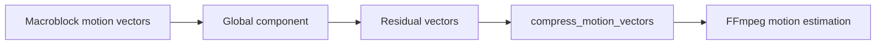

# RTCL H.264 Motion Study

카메라 이동량이 H.264 디코딩 비용에 미치는 영향을 측정하고, FFmpeg
motion estimation 경로에서 공통 움직임을 global motion vector로 분리할
수 있는지 탐색한 2024년 하계 인턴 연구 아카이브입니다.

## 연구 질문

카메라가 빠르게 움직이면 frame 전반의 motion vector가 커지고
temporal·spatial redundancy가 줄어듭니다. 이 변화가 디코딩 시간에 어떤
영향을 주는지 측정하고, 공통 이동 성분과 residual vector를 분리하는
구현 지점을 찾았습니다.

## 실험과 관찰

10초 길이의 느린 카메라 이동 영상과 빠른 이동 영상을 각각 10회
디코딩해 시간을 비교했습니다.

| 영상 | User 평균 | System 평균 | Real 평균 |
|---|---:|---:|---:|
| Slow camera motion | 2.5626 s | 0.1558 s | 0.5102 s |
| Fast camera motion | 5.1243 s | 0.3284 s | 1.1387 s |

빠른 영상에서 user time이 약 2배로 증가했습니다. 영상 내용과 encoding
조건을 완전히 통제한 benchmark는 아니므로 인과관계의 결론이 아니라
구현 방향을 정하기 위한 관찰로 사용했습니다.

## 구현 탐색

`motion_est.c`에 다음 구조를 추가하며 FFmpeg의 motion estimation
pipeline을 분석했습니다.

- frame의 motion vector 목록에서 global component를 분리하는
  `estimate_global_motion` 진입점
- macroblock별 vector에서 global vector를 뺀 residual을 수집하는
  `compress_motion_vectors`
- MuJoCo 화면을 FFmpeg로 캡처해 local RTMP server로 보내는 streaming demo

## 저장소 구조

| 경로 | 내용 |
|---|---|
| `motion_est.c` | FFmpeg motion estimation 소스와 실험 코드 |
| `stream.py` | MuJoCo viewer 실행 및 FFmpeg RTMP streaming demo |
| `customant.xml` | streaming 입력으로 사용한 MuJoCo scene |
| `meetingslides/` | 주차별 발표 자료와 real-time systems 학습 노트 |

## 사용 기술

- C, FFmpeg internals, H.264
- Python, MuJoCo
- RTMP, X11 screen capture
- Linux performance measurement

## 연구 상태와 한계

- `estimate_global_motion`은 확장 지점을 정의한 상태이며 실제 global
  motion 추정 알고리즘은 완성되지 않았습니다.
- `motion_est.c`는 독립 실행 파일이 아니라 FFmpeg source tree 안에서
  빌드되는 내부 파일입니다.
- `stream.py`의 display, FFmpeg 경로와 RTMP endpoint는 당시 실험 환경에
  맞춰져 있어 재현 시 수정이 필요합니다.
- 압축률 또는 디코딩 속도 개선을 달성했다고 주장하지 않습니다. 이
  저장소는 문제 관찰에서 시스템 코드 수정으로 이어진 연구 과정을
  보존합니다.

`motion_est.c`에 포함된 FFmpeg 코드의 저작권과 LGPL 고지는 파일 상단을
참고하세요.
